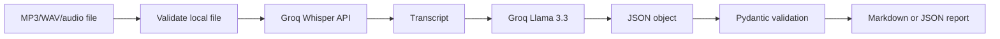

# Day 4 — Audio Transcription & Action-Item Summarizer

A Python pipeline that uploads a short audio file to Groq's hosted Whisper endpoint, turns speech into text, asks `llama-3.3-70b-versatile` to extract structured meeting information, validates the result with Pydantic, and writes a JSON or Markdown report.

> **Learning project:** audio is sent to Groq when the API path is used. Do not use confidential recordings without reviewing current provider terms and retention settings.

## What this demonstrates

- Speech-to-text with Groq `whisper-large-v3`.
- A two-stage AI pipeline: transcription first, NLP extraction second.
- JSON Object Mode plus explicit JSON-only instructions.
- Local Pydantic validation for reliable report structure.
- Action-item fields: task, owner, due date, and priority.
- Audio extension and 25 MB size validation.
- Markdown and JSON output.
- API-free unit tests with fake provider behavior.

## Architecture



Detailed design: [`docs/architecture.md`](docs/architecture.md).

## Windows setup

PowerShell:

```powershell
cd D:\Day4-audio-transcription-action-item-summarizer
py -m venv .venv
.\.venv\Scripts\python.exe -m pip install --upgrade pip
.\.venv\Scripts\python.exe -m pip install -r requirements.txt
```

Set your Groq key for the current PowerShell window:

```powershell
$env:GROQ_API_KEY = "gsk_your-key-here"
```

Never put the key in source code or commit it to GitHub.

## Test without an API key

The tests use local temporary files and fake provider behavior. They do not upload audio or spend API quota:

```powershell
.\.venv\Scripts\python.exe -m pytest -q
```

## Run with an audio file

Markdown printed to the terminal:

```powershell
.\.venv\Scripts\python.exe audio_summarizer.py "D:\Recordings\meeting.wav" --language en
```

Write a Markdown report:

```powershell
.\.venv\Scripts\python.exe audio_summarizer.py "D:\Recordings\meeting.wav" --language en --output meeting_report.md
```

Write a JSON report:

```powershell
.\.venv\Scripts\python.exe audio_summarizer.py "D:\Recordings\meeting.wav" --language en --output meeting_report.json
```

Print only the transcript:

```powershell
.\.venv\Scripts\python.exe audio_summarizer.py "D:\Recordings\meeting.wav" --language en --transcript-only
```

The `--language` option is optional. For Cantonese or Mandarin recordings, try the appropriate ISO-639-1 code such as `zh` and review the transcript carefully.

## Example report fields

```json
{
  "speaker_intent": "Coordinate the release.",
  "summary": "The team discussed the release timeline.",
  "main_points": ["The release is planned for Friday."],
  "action_items": [
    {
      "task": "Confirm the deployment checklist",
      "owner": "Mina",
      "due_date": "Thursday",
      "priority": "high"
    }
  ]
}
```

## How it works

1. Validate that the path exists, is non-empty, has a supported audio extension, and is no larger than 25 MB.
2. Upload the file to Groq's `audio.transcriptions.create()` endpoint.
3. Use `whisper-large-v3` to return transcript text.
4. Send the transcript to `llama-3.3-70b-versatile`.
5. Request JSON only with `speaker_intent`, `summary`, `main_points`, and `action_items`.
6. Validate the returned object with Pydantic.
7. Render it as Markdown or save it as JSON.

Groq's current documentation lists `whisper-large-v3` as the higher-accuracy multilingual option and `whisper-large-v3-turbo` as a faster alternative. This project uses the requested `whisper-large-v3` by default; override it with `--transcription-model` if needed.

## Cost and privacy

Groq usage may be subject to current rate limits, credits, or pricing. Very short requests may still be billed against a provider minimum. Audio and transcript text leave your computer when using the API. Use recordings you are authorized to process, and avoid passwords, private customer data, or confidential meetings until you have reviewed the provider's current terms.

## Limitations and next steps

- No diarization: it does not reliably label Speaker 1 and Speaker 2.
- No calendar or task-system integration.
- No chunking for files over the limit.
- Due dates and owners are estimates only when clearly stated in the transcript.

Next steps could add speaker diarization, chunking and overlap, confidence scores, a FastAPI endpoint, a web UI, calendar export, and human approval before sending action items to another system.

## License

MIT.
